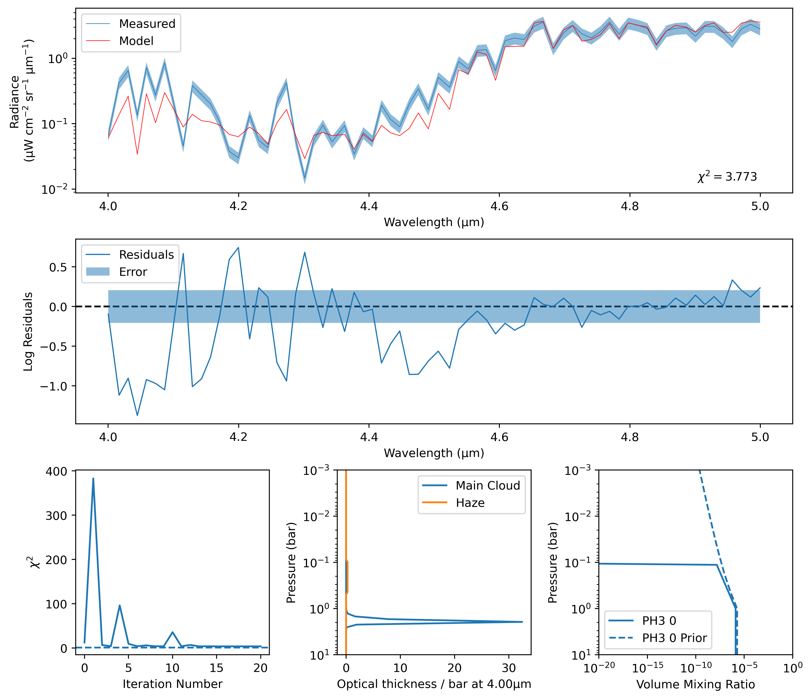
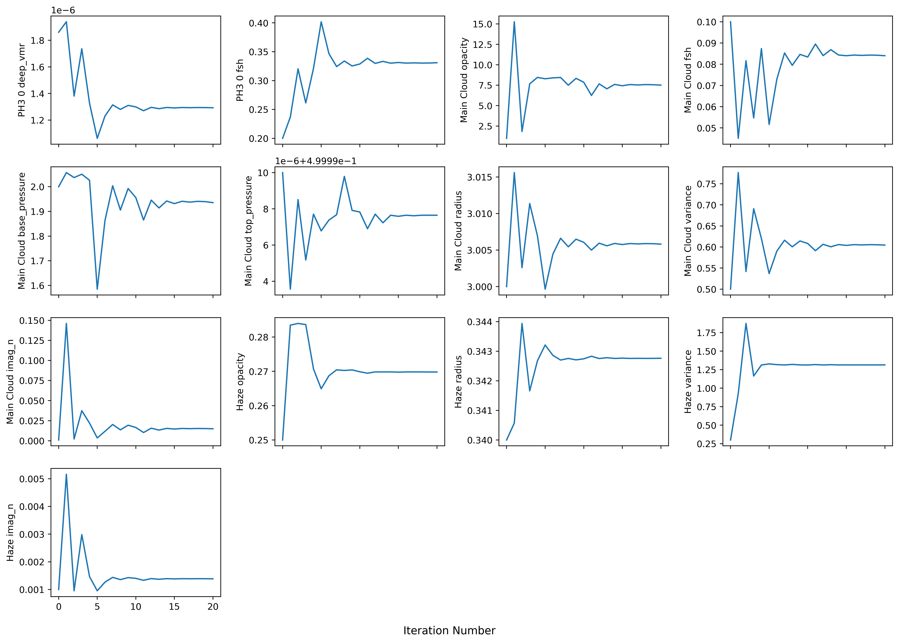

Eleos
*****

A Python interface to the NEMESIS spectral inversion tool, designed for retrievals in the near- and mid-IR of the Gas Giants.

Eleos can generate the files required for a NEMESIS retrieval using an object-oriented interface, and uses the same interface for analysing the results of a completed retrieval.

Once an Eleos-generated retrieval has been run, Eleos will generate a summary plot, showing:
- the retrieved spectrum and its errors
- the model residuals
- the chi-squared value as a function of iteration number
- the aerosol profiles that were retrieved
- the gas profiles that were retrieved

Eleos will also generate a plotof all the model parameters and how they changed over the run. This can be useful for dianosing problems, or forverifying that a retrieval has converged correctly

.. toctree::
   :maxdepth: 2
   :caption: Examples

   single_core_creation
   single_result_parsing
   multiple_core_creation
   multiple_result_parsing
   
.. toctree::
   :maxdepth: 4
   :caption: API Reference

   documentation